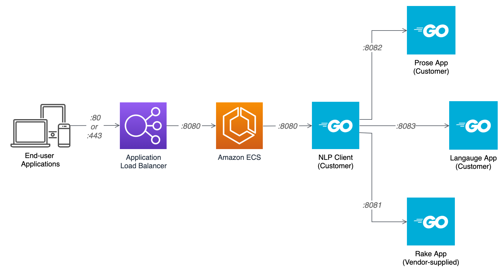

# Amazon Elastic Container Registry (ECR) Cross-Account Access for ECS Demonstration

Project files for the blog post, [Amazon Elastic Container Registry (ECR) Cross-Account Access for ECS: Deploying containerized applications on Amazon ECS using cross-account elastic container registries](https://garystafford.medium.com/amazon-elastic-container-registry-ecr-cross-account-access-for-ecs-2f90fcb02c80). Please read the post for complete instructions on how to use the files in this repository.

